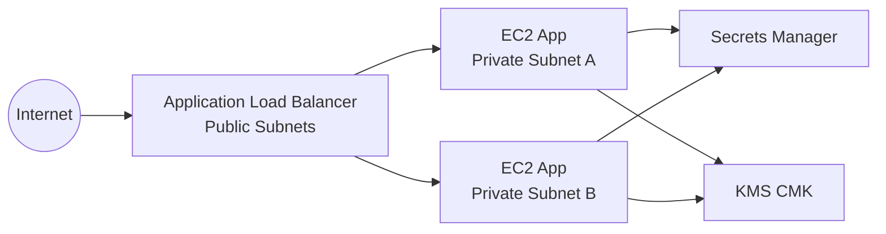

# Infraestrutura Multi-Ambiente com Terraform

Projeto de IaC com Terraform para provisionar uma arquitetura base na AWS para 3 ambientes: `dev`, `staging` e `prod`.

## Arquitetura

Cada ambiente provisiona:

- VPC dedicada
- 2 subnets publicas (ALB)
- 2 subnets privadas (EC2)
- Internet Gateway + NAT Gateway
- Application Load Balancer
- Target Group + Listeners HTTP (e HTTPS opcional com ACM)
- Auto Scaling Group de instancias EC2
- Security Groups separados para ALB e aplicacao
- IAM Role/Instance Profile para EC2 (com SSM)
- KMS Key com rotacao para criptografia
- Secret no AWS Secrets Manager por ambiente



## Estrutura de Pastas

```text
.
├── modules/
│   └── app_environment/
│       ├── main.tf
│       ├── variables.tf
│       ├── outputs.tf
│       └── templates/
│           └── user_data.sh.tftpl
├── environments/
│   ├── dev/
│   ├── staging/
│   └── prod/
├── .gitignore
└── README.md
```

## Reuso com Modulos

- O modulo `modules/app_environment` concentra recursos comuns.
- Cada ambiente em `environments/*` apenas injeta variaveis especificas.
- Isso evita duplicacao e facilita manutencao.

## Diferencas por Ambiente

- `dev`: menor custo (`t3.micro`, capacidade baixa)
- `staging`: intermediario (`t3.small`)
- `prod`: maior capacidade (`t3.medium`, ASG maior, volume maior)

As diferencas estao em `terraform.tfvars` de cada ambiente.

## Seguranca Aplicada

- Instancias em subnets privadas
- ALB em subnets publicas
- Acesso de aplicacao permitido apenas do Security Group do ALB
- Criptografia em repouso com KMS (EBS e Secrets Manager)
- IAM com privilegios minimos para leitura de segredo
- Sem credenciais hardcoded no codigo
- Suporte a HTTPS com ACM em producao (quando `certificate_arn` for informado)

## Pre-Requisitos

- Terraform >= 1.6
- Conta AWS e credenciais configuradas (AWS CLI, perfil ou variaveis de ambiente)
- Permissoes para criar recursos de rede, EC2, IAM, ALB, KMS e Secrets Manager

## Como Usar

### 1) Ajustar variaveis por ambiente

Edite `environments/<ambiente>/terraform.tfvars` e atualize principalmente:

- `ami_id`
- `azs` (se necessario)
- `alb_ingress_cidrs` (restringir em prod)
- `certificate_arn` (habilitar HTTPS em prod)

### 2) Opcional: popular segredo sem versionar

Em cada ambiente:

1. Copie `secrets.auto.tfvars.example` para `secrets.auto.tfvars`
2. Preencha com valores reais

Arquivo `secrets.auto.tfvars` e ignorado pelo Git.

### 3) Inicializar e aplicar

Exemplo para `dev`:

```bash
cd environments/dev
terraform init
terraform plan
terraform apply
```

Para `staging` e `prod`, repita no respectivo diretorio.

### 4) Outputs uteis

- `alb_dns_name`
- `vpc_id`
- `autoscaling_group_name`
- `secret_arn`

## Dependencias Entre Recursos

- Subnets dependem da VPC
- NAT depende do Internet Gateway e subnet publica
- ALB depende de subnets publicas e SG do ALB
- ASG depende de launch template, subnets privadas e target group
- Secret e volumes dependem da chave KMS
- Permissao IAM de leitura depende do segredo e da chave KMS

## Boas Praticas Operacionais

- Nao armazenar segredos em `terraform.tfvars` versionado
- Usar backend remoto + locking para trabalho em equipe (S3 + DynamoDB)
- Adicionar pipeline CI para `terraform fmt`, `validate` e `plan`
- Revisar periodicamente regras de SG e IAM

## Proximos Melhoramentos

- WAF no ALB
- VPC Endpoints para trafego privado a servicos AWS
- CloudWatch alarms e autoscaling por metrica
- Banco de dados gerenciado por ambiente
- Remote state com workspaces e politicas de acesso
